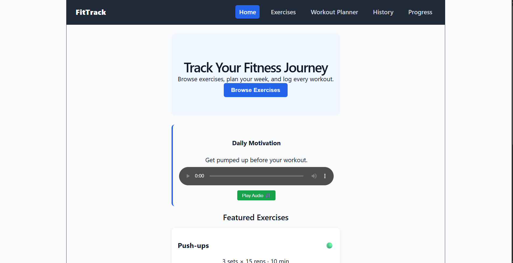
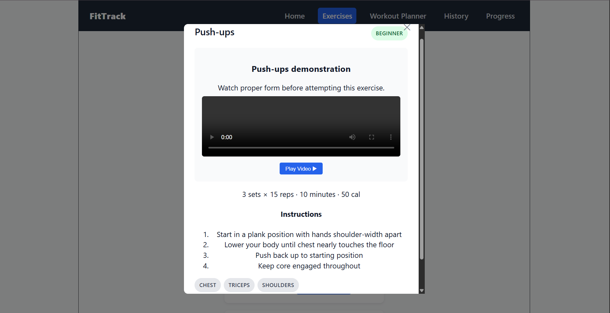
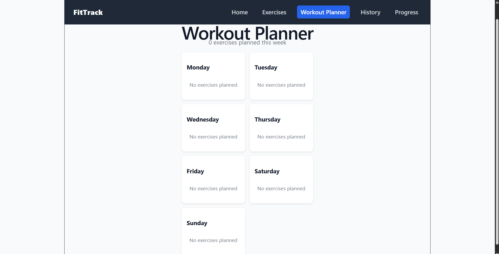
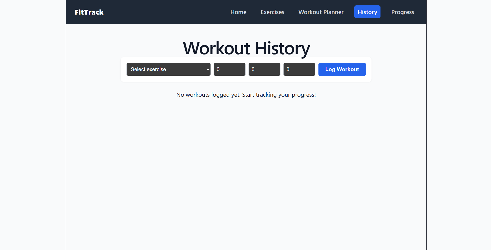
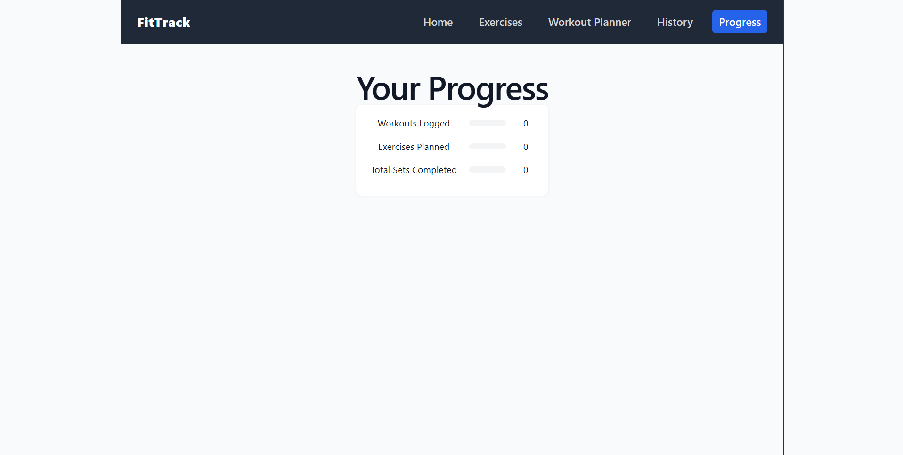
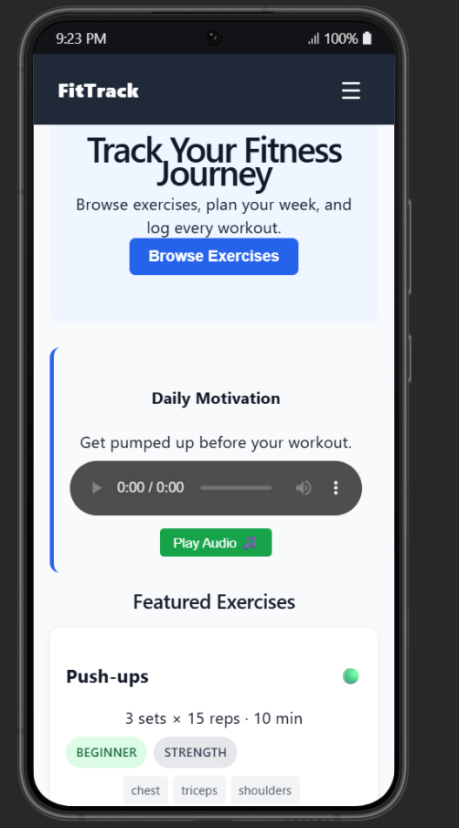
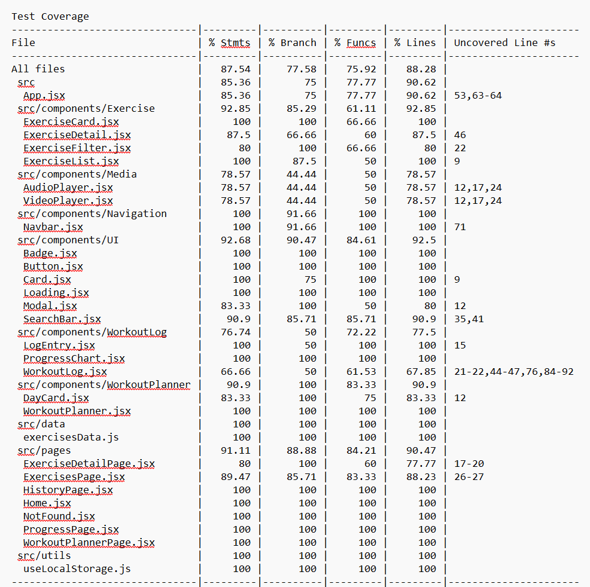

# FitTrack - Modern React Fitness Tracker & Workout Planner

FitTrack is a modern, responsive React application built for fitness center members to explore exercises, build weekly workout routines, watch demonstration videos, listen to motivational audio tracks, and log workout progress over time.

---

## 🌟 Key Features

- **Exercise Library & Filter**: Search 25+ exercises by keyword, category (*Strength, Cardio, Flexibility, Balance*), muscle group, or difficulty (*Beginner, Intermediate, Advanced*).
- **Exercise Details & Video Demos**: View detailed exercise breakdowns, step-by-step form instructions, and embedded HTML5 video player controls.
- **Weekly Workout Planner**: Assign exercises to a 7-day schedule (Monday–Sunday) with persistent `localStorage` synchronization.
- **Workout Logging**: Log completed workouts with sets, reps, weight (kg), and date, including on-blur input validation.
- **Progress Tracking & Analytics**: Visual progress dashboard monitoring total workouts logged, weekly exercises planned, total sets completed, and estimated calories burned.
- **Motivational Audio Integration**: Embedded HTML5 audio player with motivational tracks.
- **Responsive Navigation**: Adaptive header navigation bar with active-route highlights and a mobile hamburger menu toggle.

---

## 🛠️ Technologies Used

- **React 19**: Functional components, custom hooks (`useLocalStorage`), `useState`, `useEffect`, `useRef`.
- **React Router DOM 7**: Multi-page client-side routing, URL route parameters (`/exercises/:id`), and 404 fallback page.
- **PropTypes**: Runtime type checking across components.
- **CSS Modules & Inline Styles**: Scoped CSS modules, dynamic inline styles, and conditional styling.
- **Jest & React Testing Library**: Comprehensive automated test suite with mock functions and coverage reports.

---

## 🚀 Installation & Quick Start

```bash
# 1. Install dependencies
npm install

# 2. Start the development server
npm run dev

# 3. Run Jest test suite
npm test

# 4. Generate coverage report
npm test -- --coverage
```

---

## 📂 Project Structure

src/
├── components/
│ ├── Exercise/ # ExerciseCard, ExerciseDetail, ExerciseFilter, ExerciseList
│ ├── Media/ # AudioPlayer, VideoPlayer
│ ├── Navigation/ # Navbar
│ ├── UI/ # Badge, Button, Card, Loading, Modal, SearchBar
│ └── WorkoutLog/ # LogEntry, ProgressChart, WorkoutLog
├── data/ # exercisesData.js (25 sample exercises)
├── pages/ # Home, ExercisesPage, ExerciseDetailPage, WorkoutPlannerPage, HistoryPage, ProgressPage, NotFound
├── utils/ # useLocalStorage.js
├── App.jsx # Central app state & Router setup
├── setupTests.js # Jest DOM matchers configuration
└── main.jsx # React entry point


---

## 🧩 Component Overview

- **Navbar**: Sticky header with route links, active page highlighting, and mobile drawer toggle.
- **ExerciseCard**: Summary card showing difficulty badge, muscle group tags, and plan addition buttons.
- **ExerciseDetail**: Comprehensive modal or detail page displaying instructions and video demonstration.
- **WorkoutPlanner & DayCard**: 7-day schedule matrix displaying planned routines per day.
- **WorkoutLog & LogEntry**: Workout input form with input validation and chronological history items.
- **ProgressChart**: Dynamic visual bar indicators for workout completion metrics.
- **VideoPlayer & AudioPlayer**: HTML5 media components with custom play/pause toggle controls and state.

---

## 🔄 State Management & Routing

- **State Architecture**: Core application state (`exercises`, `workoutPlan`, `workoutHistory`, `selectedExercise`) is lifted to `App.jsx` and persisted to browser `localStorage`.
- **Routing Table**:
  - `/` → **Home** (Hero section, daily motivation audio, featured exercises)
  - `/exercises` → **ExercisesPage** (Search, filters, grid view)
  - `/exercises/:id` → **ExerciseDetailPage** (Dynamic detail view with navigation buttons)
  - `/workout-planner` → **WorkoutPlannerPage** (7-day weekly schedule)
  - `/history` → **HistoryPage** (Workout logging form and log history)
  - `/progress` → **ProgressPage** (Visual analytics dashboard)
  - `*` → **NotFound** (404 catch-all page)

---

## 🧪 Testing Strategy & Coverage Report

The test suite contains **53 tests across 16 test suites**, covering component rendering, user interactions, routing, custom hooks, async operations, and conditional rendering states.

| File Category | % Statements | % Branch | % Functions | % Lines |
| :--- | :--- | :--- | :--- | :--- |
| **All Files** | **87.5%** | **77.6%** | **75.9%** | **88.3%** |
| `src/components/Exercise` | 92.9% | 85.3% | 61.1% | 92.9% |
| `src/components/Media` | 78.6% | 44.4% | 50.0% | 78.6% |
| `src/components/Navigation` | 100.0% | 91.7% | 100.0% | 100.0% |
| `src/components/UI` | 92.7% | 90.5% | 84.6% | 92.5% |
| `src/components/WorkoutLog` | 76.7% | 50.0% | 72.2% | 77.5% |
| `src/components/WorkoutPlanner` | 90.9% | 100.0% | 83.3% | 90.9% |
| `src/pages` | 91.1% | 88.9% | 84.2% | 90.5% |
| `src/utils` | 100.0% | 100.0% | 100.0% | 100.0% |

---

## 🖼️ App Screenshots

1. **Home Page**:  
   

2. **Exercises Page with Filters**:  
   

3. **Exercise Detail Page with Video**:  
   

4. **Workout Planner Page**:  
   

5. **Workout History Page**:  
   

6. **Progress Tracking Page**:  
   

7. **Mobile Responsive View**:  
   

8. **Test Coverage Report**:  
   

---

## 🔮 Future Enhancements

- Integration with smartwatch APIs (Apple Health / Google Fit).
- Custom user-created exercise creation modal.
- Dark / Light theme toggle setting.
- Add videos and images of exercises